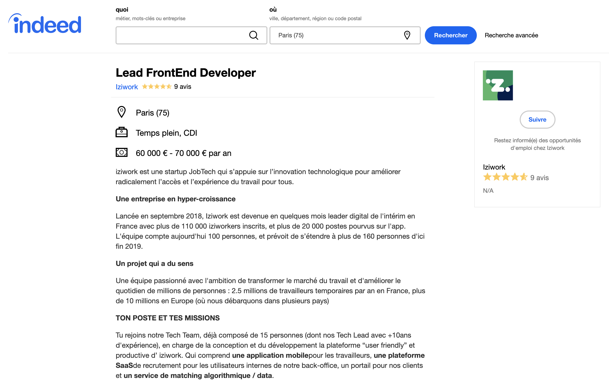
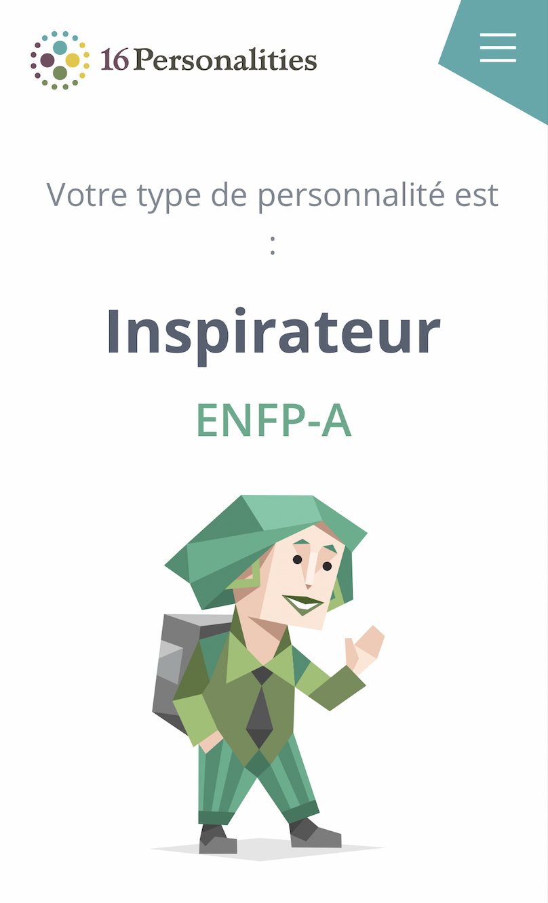
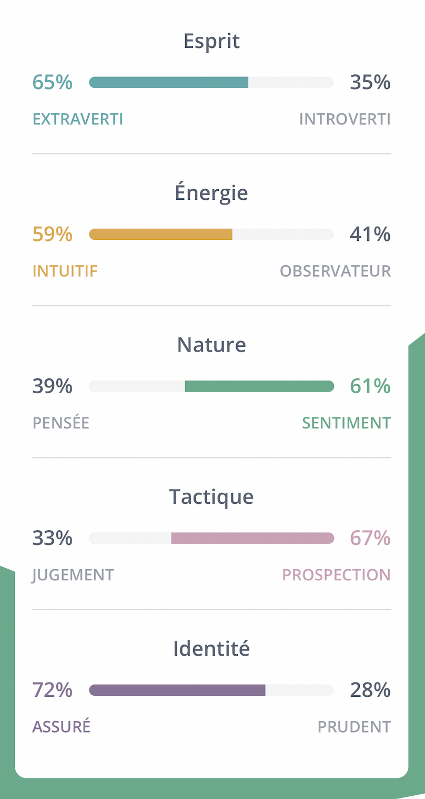
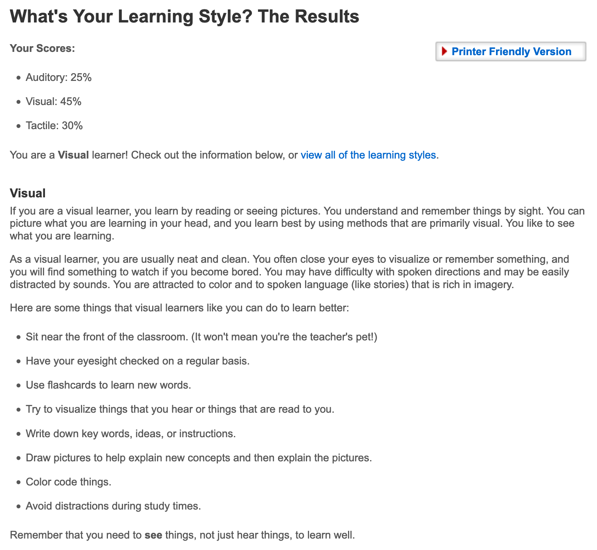
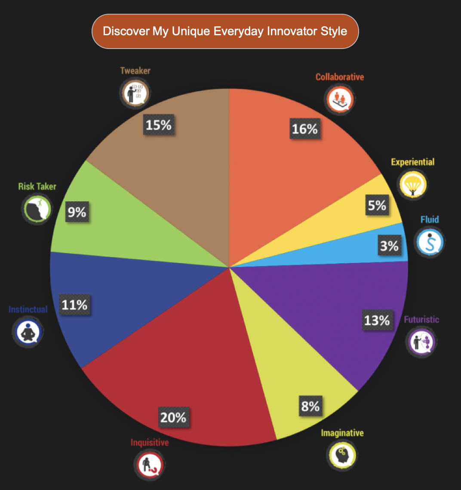

## Introduction to IT : Assignment 1

### Personal Information :

Hello, my name is Bartholomé Peltais, I’m 21 years old and I come from France.
I speak French, English and a little bit german. In France I’m studying a digital program, I learn web development, web design and management. In RMIT, my student number is s3818190. If you want to contact me during my semester in Vietnam, please send an e-mail to s3818190@rmit.edu.vn.
I love travelling, getting to know new countries and their cultures and last but not least their local food ! I listen to a lot of music each day and I like to play video games. Plus, regarding my sport experience, I played golf for 10 years and my favorite sports are water sports like surf and kitesurf ! Besides, I’m a fan of trucks and vanlife since I was a kid !

### Interest in IT :

My main interest for IT is the vastness of the possibilities offered by new technologies. Today we are able to develop websites, applications quite easily. New technologies allow us to do such incredible things ! What interests me the most is the front-end development is that it allows us to create beautiful user interfaces. Nowadays, thanks to javascript, we can develop the front and back part of a website, for example thanks to the react frameworks for the front and node.js for the back. My goal is to be able to manage with these two frameworks in order to be as autonomous as possible.
 
My interest for IT started when I was a kid. My father shared with me his passion for new technologies. I was lucky to have my first computer when I was 8 years old. He showed me not only how the operating system (Mac OS 9) worked but also the file system, folders, how to use a web browser and do word processing. I am curious so I started doing some research to better understand how it works. Then all the knowledge I have acquired is the result of many hours of research.
 
The experiences I have in IT are about front-end web development. As a part of my studies I have the chance to work with companies during concrete projects. In addition, I did a two-month internship in which I had to redesign a web platform for software licensing.
 
I chose to come to study at RMIT because it was the only university that offered IT and web development courses. I also knew its very good reputation worldwide. During my semester at RMIT, I hope I will make progress in English, and especially gain skills in the subjects I study in my curriculum in France.

### Ideal job : 

https://www.indeed.fr/voir-emploi?cmp=Iziwork&t=Lead+Frontend+Developer&jk=10f2577588a90c6b&q=lead+developer+%E2%82%AC55%C2%A0000&vjs=3
 
This offer pleases me because being lead developer aims at managing a team of developer.
In particular, become a front-end lead developer interesting me a lot because front-end is the part I prefer in web development. Moreover, as developers, it is the job that has the most responsibility and is the best paid.
 
To access this job, you must first have experiences as a developer and more precisely in the stack used by the company. It is necessary to know and master development processes. In addition, you must have experience as a team leader / manager.
 
My studies allow me to acquire the basics of management as well as to know how to use different languages of web development. I'm also working by my own to learn how to use new frameworks. Then, the internships I did allowed me to gain skills as well.
 
In order to get all the skills required for this job, I rely on my two last years of studies while I will do a block release training. After my studies I will take advantage of my first years of experience to learn as much as possible in contact with senior developer and of course continue personal projects to also learn by my own.

### Personal profile :

#### Myers-Briggs test :

#### Learning style test :
 
 
 

#### Innovation Quotient Edge Assessment :

##### What do the results of these tests mean for you ?

Regarding the test results, I agree with only one out of three tests, the Myers-Briggs test. As for the learning style test, the results say that I am visual while I am more auditory to learn. If not for the archetypal test, I do not agree with the fact that I get only 8% of imagination. Since I was little, I have always had a lot of imagination no matter the field.

##### How do you think these results may influence your behaviour in a team ?

These results will never influence my attitude as I do not really believe it. I find that this kind of test can be fun to do but not more. 
I think it's not an online test that will define who we are.
 
##### How should you take this into account when forming a team ?

I would not take these tests into account to form a team, I know very well that in a team it is important to have complementary profiles but I prefer to identify people without testing but by talking with them for real.

### Project idea :

#### Overview:

The project I would like to realize is directly related to one of my passions, van lifing. I would like to develop an app that would be a real companion on the road. There are already a number of applications of this type but I noticed that none of them had a pleasant user interface to use. I would like to make this app a kind of guide for vanlifers. I would like the community to interact within the application to enrich it with new data. For example, concerning more interesting itineraries to take rather than others etc. The vanlifers are not always well consider by sedentary people, so it could be interesting to identify practical spots for travelers.

#### Motivation: 

While traveling on the road, there are many things to consider. For example, find a spot to recharge van’s battery if you do not have solar panels or a place to fill the water tank. Moreover, in many countries it is forbidden to park vans where we want to spend the night. Some people do not have showers in their van so it can be interesting to list the places where taking a shower is possible.
 
This project is of particular interest to me because as written above in my description, since I was a child, trucks and van life have always fascinated me ! I have always been very appreciative of these people who have chosen to lead a life or a part of it on the road to fill a need of freedom and live without normal life constraints.

#### Description:

In this part I will address the different features of the application I want to create. As a reminder, this application is intended to accompany travelers on the road.
 
First, when the user starts the app, he will look the menu which is composed of icons that will present the different features. The different functionalities to which the user will have access are: an interactive map of the best itineraries to take according to the regions of the countries, access to the location of the most beautiful places to stop and spend the night with their rolling homes. Pictures, comments and notes feed the places allowing you to choose your "spots". In order to have some driving comfort to improve itinerary, I would like to connect the waze app API to take advantage of road warnings and waze itinerary optimization app.
I would also like to propose an offline mode. The application saves for you all the information. No need to have an internet connection if you have saved them in advance. This mode would pay off.
 
Second, a part of the app will be dedicated to the specificities for gas and electricity in different countries with the adapters to have. Users will also have access to some legislation concerning van and camper per country. Another interesting feature is the location of the spots to charge the batteries and fill the water tanks for free. But this app also refers to paying areas offering: a service station (drinking water, battery recharging, emptying), selective trash and Wifi access. As said above, many vanlifers do not have toilets or showers in their van, so I found it logical to list the places where they can find it. The vanlifer community keeps growing, I wish everyone could add data in each part of the app because the best way to know all these spots is to travel! It is therefore important to involve the first concerned. I imagined a community section where travelers could decide to meet one another when they are in the same area.

Third, an activities section will be present on the app. This is another feature, it will come in the form of an interactive map as well. It will work much like the mapstr app. Depending on the geographical areas where the travelers are, they can identify different activities to do around them by placing GPS points. This can involve any activity, it can be hiking, cycling, kayaking or surfing. But we can see more than sports activities, cultural activities such as museums or visits of all kinds can be interesting to identify.

To finish, in order to motivate the vanlifers community to share all these tips on the app, I would like to set up a progression system. For each shared information and type of information, the user will earn points. To thank participating users, the points they earn will allow them to move from one level to another. From a certain level, gifts such as free offline access to the application for one or two months or free one or two months subscriptions for VPN services.

#### Tools and technologies: 

Regarding the technical part, the app will be developed in react-native. I make this choice so that my app is compatible on both ios and android, which would not have been possible if I decided to write the app in swift. The data management part will be done using redux. This tool will allow the setting favorites of certain spots by the users for example.
The database will work thanks to mongodb. As for the server part I decided to use node.js.
I prefer to keep my stack with only one language. So I love using javascript for everything.
As written in the project description, I would need to connect the waze app API to the app I want to create.

#### Skill required : 

The skills required for this application project are quite varied.
First of all,  before talking about the development part, there is the part wireframes and models. For this phase I need skills in UX & UI design. Software like adobe xd, photoshop or sketch.
Then for the development part, I need to master the stack chosen for this project. That is react-native for the front part, redux for managing and manipulating data, mongodb for the database and node.js for the server part.To assimilate the skills needed for this project, I'm going to need to follow long tutorials and read a lot of online courses.
Regarding the knowledge I already have, I am currently learning how to use the react framework. I also have some skills on node.js but I have not used redux or mongodb yet, so long hours of learning are waiting for me.

#### Outcome : 
If the project was successful, I hope it will be used extensively by travelers and the vanlifers community. That users consider the app really like a companion that accompanies them in all their travels. This app is more complete in terms of functionality than others who are already on the market. What I criticized for the existing apps was their user interfaces that were not up to date and sometimes lacked UX principles. The expected impact of this development is to always go in the direction of the community so that it remains welded. If this app can allow new vanlifers to simplify their debut in this lifestyle then I would be delighted. I would like to allow the community to grow as it has for 10 years so this project has been really rewarding for me and a huge victory. 
